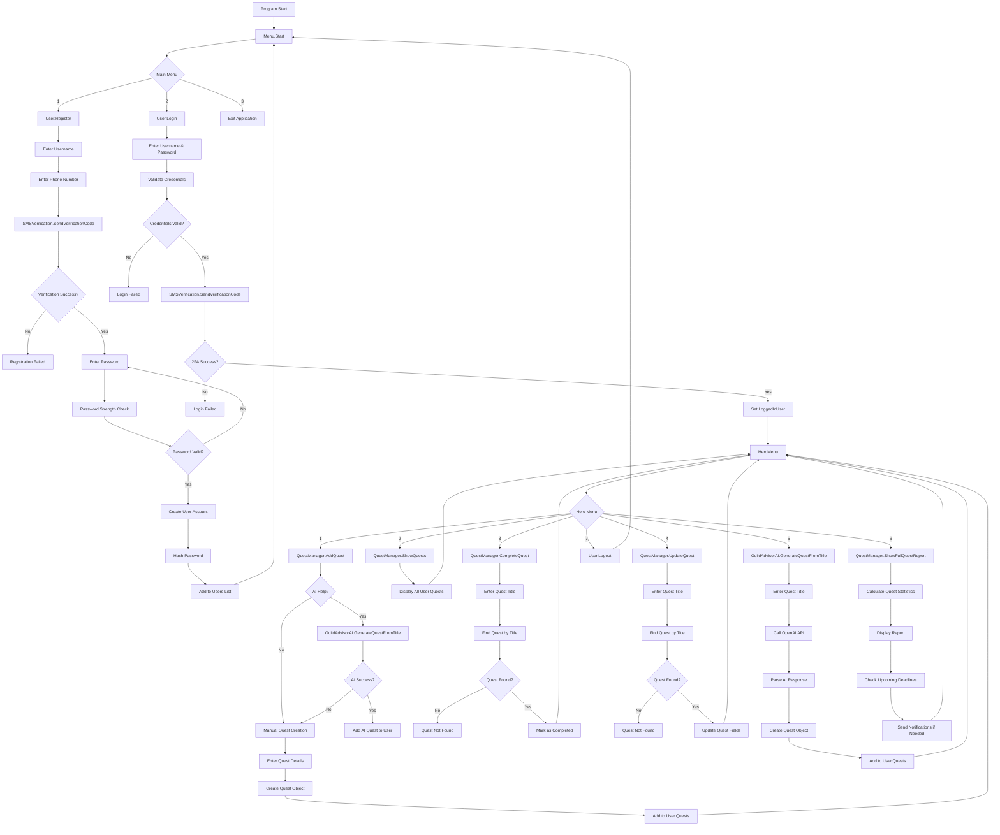
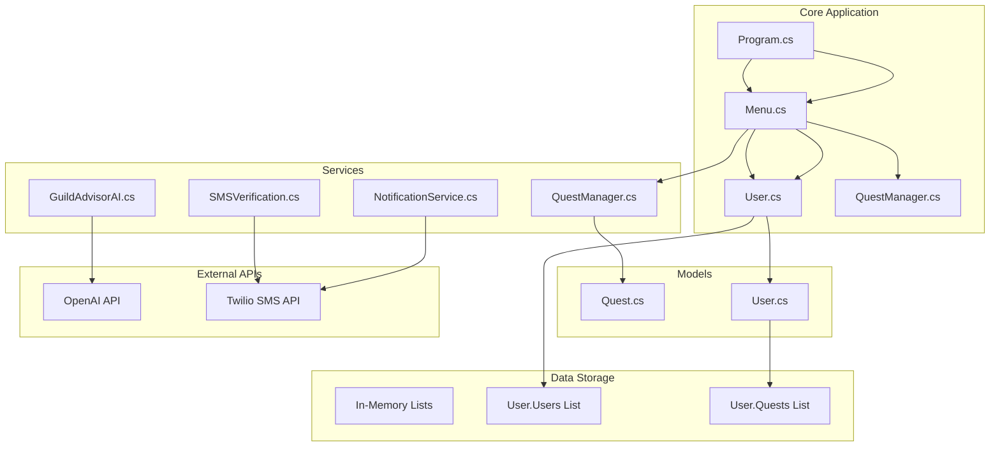
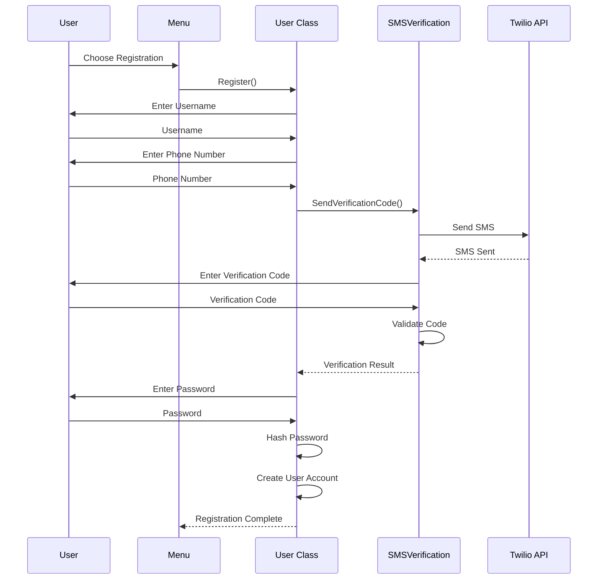
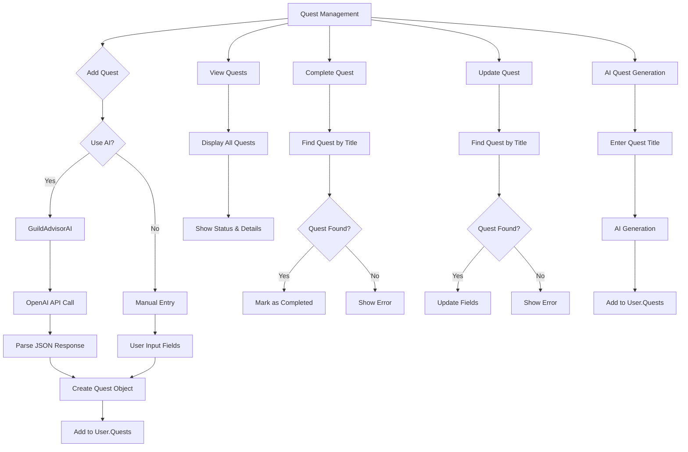
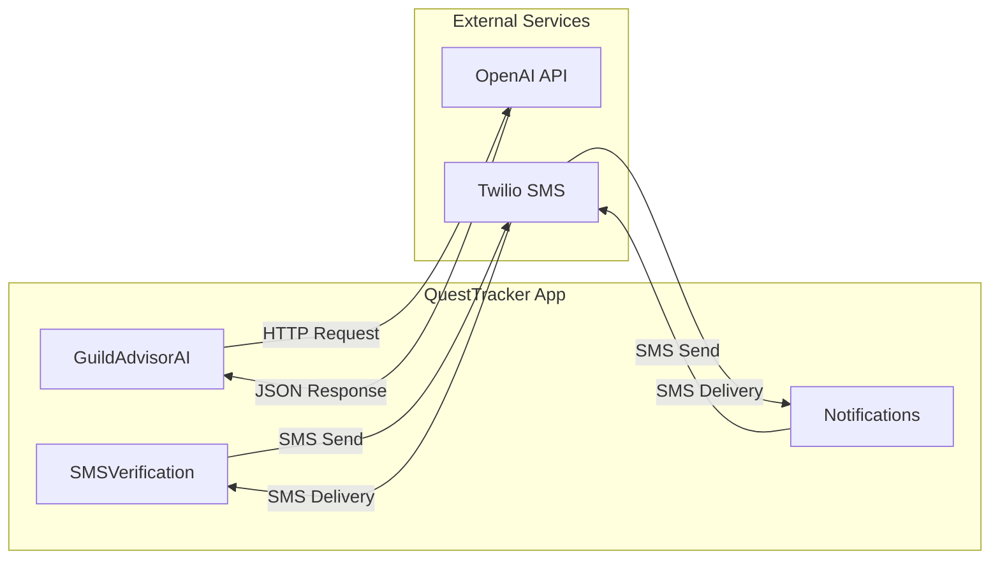

# QuestTracker Console Adventure Manager - System Flowchart

## Main Application Flow



## System Architecture



## Authentication Flow



## Quest Management Flow



## Data Models

```mermaid
classDiagram
    class Quest {
        +string Title
        +string Description
        +DateTime DueDate
        +string Priority
        +bool IsCompleted
    }
    
    class User {
        +string Username
        +string PasswordHash
        +string PhoneNumber
        +List~Quest~ Quests
        +static List~User~ Users
        +static User LoggedInUser
        +Register()
        +Login()
        +Logout()
        +Hash()
    }
    
    class QuestManager {
        +AddQuest()
        +ShowQuests()
        +CompleteQuest()
        +UpdateQuest()
        +CheckForUpcomingDeadlines()
        +ShowFullQuestReport()
    }
    
    class GuildAdvisorAI {
        +GenerateQuestFromTitle()
    }
    
    class SMSVerification {
        +SendVerificationCode()
    }
    
    class Notifications {
        +SendQuestDeadlineAlert()
    }
    
    User ||--o{ Quest : contains
    QuestManager --> Quest : manages
    QuestManager --> User : works with
    GuildAdvisorAI --> Quest : creates
    SMSVerification --> User : verifies
    Notifications --> User : notifies
```

## External Integrations



## Key Features Summary

1. **User Management**: Registration with phone verification and password strength validation
2. **Quest Management**: CRUD operations for quests with manual and AI-assisted creation
3. **AI Integration**: OpenAI API for generating quest descriptions and details
4. **SMS Notifications**: Twilio integration for verification and deadline alerts
5. **Security**: Password hashing and two-factor authentication
6. **Reporting**: Comprehensive quest statistics and deadline monitoring

## Technology Stack

- **Language**: C# (.NET 9.0)
- **UI Framework**: Spectre.Console for rich console interface
- **AI Integration**: OpenAI GPT-4o-mini API
- **SMS Service**: Twilio API
- **Security**: SHA256 password hashing
- **Configuration**: dotenv.net for environment variables

