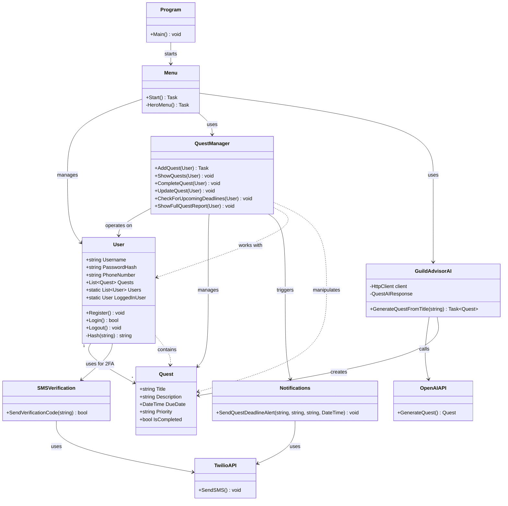

# QuestTracker UML Class Diagram

## System Architecture Overview

This UML diagram represents the QuestTracker Console Adventure Manager system, showing the relationships between classes, services, and data models.

## Key Relationships Explained

### 1. **Core Data Model**
- `User` has a one-to-many relationship with `Quest`
- Each user can have multiple quests
- User authentication includes phone verification

### 2. **Service Layer Architecture**
- `QuestManager` handles all quest-related operations
- `GuildAdvisorAI` provides AI-powered quest generation
- `Notifications` and `SMSVerification` handle communication

### 3. **External Integrations**
- **Twilio API**: SMS verification and deadline notifications
- **OpenAI API**: AI-powered quest generation

### 4. **User Flow**
1. User registration with phone verification
2. Login with 2FA
3. Quest management through Menu system
4. AI assistance for quest creation
5. Automated deadline notifications

## Design Patterns Used

### 1. **Static Service Pattern**
- `QuestManager`, `GuildAdvisorAI`, `Notifications`, and `SMSVerification` are static classes
- Provides utility functions without instantiation

### 2. **Repository Pattern (Implicit)**
- `User.Users` static list acts as an in-memory repository
- Quest data is stored within User objects

### 3. **Service Layer Pattern**
- Clear separation between UI (Menu), business logic (QuestManager), and external services
- Each service has a specific responsibility

### 4. **Dependency Injection (Environment-based)**
- External API keys loaded via environment variables
- Services configured through .env file

## Security Features

1. **Password Hashing**: SHA256 encryption for passwords
2. **Two-Factor Authentication**: SMS verification for login
3. **Input Validation**: Password strength requirements
4. **Secure API Communication**: Bearer token authentication

## External Dependencies

- **Spectre.Console**: Rich console UI
- **Twilio**: SMS services
- **OpenAI**: AI quest generation
- **dotenv.net**: Environment variable management
- **System.Text.Json**: JSON serialization
